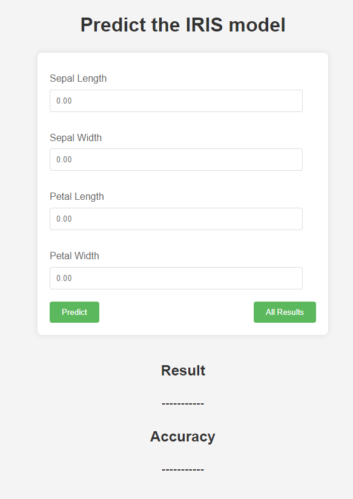

## The Iris dataset and scikit-learn and using with flask app
This is a example of using the Iris dataset with scikit-learn and using it with a Flask app

## Structure folder
```bash
.
├── model
│   ├── iris_classifier.joblib
│   ├── train.py
├── src
│   ├── app.py
│   ├── templates
│   │    ├── index.html
├── README.md
```

## How to run
1. Clone the repository
```bash
git clone
```
2. Install the scikit-learn and Flask
```bash
pip install scikit-learn Flask
```
3. Run the train.py
```bash
python model/train.py
```
4. Run the app.py
```bash
python src/app.py
```
5. Open the browser and go to http://localhost:5000

<!-- img -->
